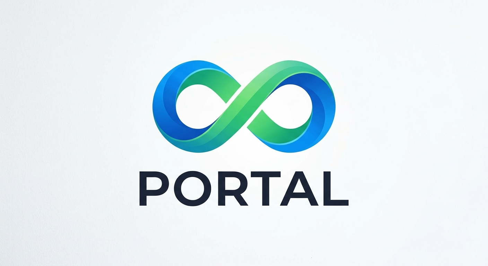

<p align="center">
  
</p>

<p align="center">
  <strong>A Swift networking library that runs everywhere — including Android.</strong>
</p>

<p align="center">
  
  
  
  
</p>

---

## Why Portal?

Portal is a lightweight, protocol-driven HTTP networking library written entirely in Swift. What makes it unique: **it runs on Android**. The `PortalNIO` target is built on [SwiftNIO](https://github.com/apple/swift-nio) and [AsyncHTTPClient](https://github.com/swift-server/async-http-client), both of which support Linux and [Swift on Android](https://www.swift.org/documentation/android/), giving you a single networking stack across iOS, macOS, Linux, and Android — no Kotlin, no Java.

---

## Features

- **Cross-platform** — iOS 15+, macOS 12+, Linux, Android (via Swift on Android)
- **Async/Await** — native Swift concurrency throughout
- **Dual transport layer** — `URLSessionTransport` for Apple platforms, `NIOTransport` for Linux/Android
- **Interceptor pattern** — adapt requests and implement retry logic in one place
- **Multipart uploads** — built-in support for file and media uploads
- **Trace logger** — configurable request/response console logging
- **Protocol-oriented** — mock any transport or portal instance in tests

---

## Installation

### Swift Package Manager

Add Portal to your `Package.swift`:

```swift
dependencies: [
    .package(url: "https://github.com/caggiulio/Portal.git", from: "1.0.0")
]
```

Then add the target you need:

| Target | Use when |
|--------|----------|
| `Portal` | iOS / macOS (uses `URLSession`) |
| `PortalNIO` | Linux / Android (uses SwiftNIO + AsyncHTTPClient) |

```swift
.target(
    name: "MyApp",
    dependencies: [
        // Apple platforms
        .product(name: "Portal", package: "Portal"),

        // OR Linux / Android
        .product(name: "PortalNIO", package: "Portal"),
    ]
)
```

---

## Quick Start

### 1. Create a Portal instance

**Apple platforms (URLSession)**

```swift
import Portal

let portal = Portal(
    baseURL: "https://api.example.com",
    transport: URLSessionTransport()
)
```

**Linux / Android (NIO)**

```swift
import PortalNIO

let portal = Portal(
    baseURL: "https://api.example.com",
    transport: NIOTransport()
)
```

### 2. Define a request

```swift
let request = PortalRequest(
    method: .get,
    path: (url: "/users/42", query: nil),
    header: ["Authorization": "Bearer \(token)"]
)
```

### 3. Send it

```swift
struct User: Decodable {
    let id: Int
    let name: String
}

let user: User = try await portal.send(request: request)
```

---

## Interceptors

Implement `PortalInterceptorProtocol` to adapt every outgoing request or retry on failure:

```swift
class AuthInterceptor: PortalInterceptorProtocol {
    func adapt(_ request: PortalRequest) -> PortalRequest {
        var r = request
        r.header?["Authorization"] = "Bearer \(TokenStore.current)"
        return r
    }

    func retry(_ request: PortalRequest, dueTo error: Error) async throws -> RetryResult {
        guard (error as? PortalError)?.statusCode == 401 else { return .doNotRetry }
        try await TokenStore.refresh()
        return .retry
    }
}

let portal = Portal(
    baseURL: "https://api.example.com",
    transport: URLSessionTransport(),
    interceptor: AuthInterceptor()
)
```

---

## Multipart Uploads

```swift
let image = PortalMedia(
    key: "avatar",
    filename: "photo.jpg",
    mimeType: "image/jpeg",
    data: imageData
)

let boundary = UUID().uuidString
let response: UploadResponse = try await portal.send(
    request: uploadRequest,
    medias: [image],
    boundary: boundary
)
```

---

## Logging

```swift
portal.logLevel = .debug  // prints request + response details
portal.logLevel = .none   // silence all output
```

---

## Architecture

```
Portal/
├── Portal/
│   └── Classes/
│       ├── Core/
│       │   ├── Base/          # Portal + PortalProtocol
│       │   ├── Transport/     # HTTPTransport + URLSessionTransport
│       │   ├── Models/        # PortalRequest, PortalMedia
│       │   ├── Error/         # PortalError
│       │   ├── Interceptor/   # PortalInterceptorProtocol
│       │   └── Logger/        # PortalTraceLogger
│       └── Extensions/
└── PortalNIO/
    └── NIOTransport.swift     # SwiftNIO transport (Linux / Android)
```

---

## Android Support

Portal runs on Android through [Swift on Android](https://www.swift.org/documentation/android/). Use the `PortalNIO` target — it has zero Apple-platform dependencies. The underlying `AsyncHTTPClient` and `SwiftNIO` libraries have full Linux/Android support.

A typical Android integration uses the Swift Android SDK toolchain to compile your Swift networking layer and bridge it to the Android app via JNI or a higher-level framework such as [Skip](https://skip.tools).

---

## Requirements

| Target | Swift | Platform |
|--------|-------|----------|
| `Portal` | 5.9+ | iOS 15+, macOS 12+ |
| `PortalNIO` | 5.9+ | Linux, Android, macOS 12+ |

---

## License

Portal is released under the MIT license. See [LICENSE](LICENSE) for details.

---

<p align="center">Made with Swift — runs everywhere.</p>
