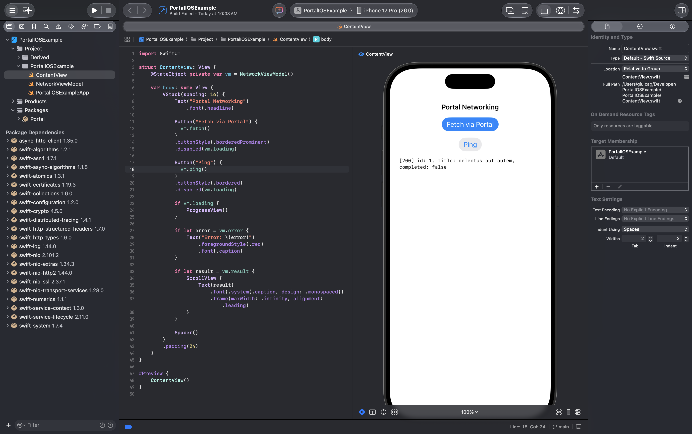
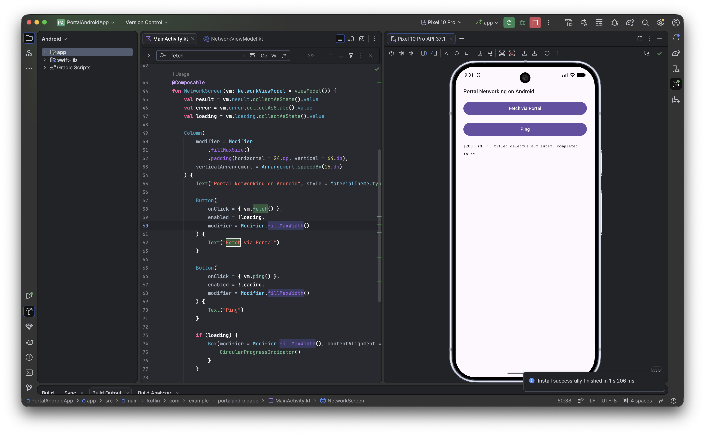

<p align="center">
  
</p>

<p align="center">
  <strong>A Swift networking library that runs everywhere — including Android.</strong>
</p>

<p align="center">
  
  
  
  
  
  
</p>

> **Early release.** Portal is actively developed. The core API is stable, but new features — persistent caching, disk-backed stores, additional interceptor utilities, and broader Android tooling — are planned for upcoming releases. Feedback and contributions are welcome.

---

<table align="center" border="0" cellpadding="8">
  <tr>
    <td align="center"></td>
    <td align="center"></td>
  </tr>
  <tr>
    <td align="center"><em>iOS</em></td>
    <td align="center"><em>Android</em></td>
  </tr>
</table>

---

## Why Portal?

Portal is a lightweight, protocol-driven HTTP networking library written entirely in Swift. What makes it unique: **it runs on Android**. The `PortalNIO` target is built on [SwiftNIO](https://github.com/apple/swift-nio) and [AsyncHTTPClient](https://github.com/swift-server/async-http-client), both of which support Linux and [Swift on Android](https://www.swift.org/documentation/android/), giving you a single networking stack across iOS, macOS, Linux, and Android — no Kotlin, no Java.

---

## Features

- **Cross-platform** — iOS 15+, macOS 12+, Linux, Android (via Swift on Android)
- **Async/Await** — native Swift concurrency throughout
- **Dual transport layer** — `URLSessionTransport` for Apple platforms, `NIOTransport` for Linux/Android
- **Response caching** — per-request `CachePolicy`, ETag / `Cache-Control` support (currently in-memory only)
- **Interceptor pattern** — adapt requests and implement retry logic in one place
- **Multipart uploads** — built-in support for file and media uploads
- **Trace logger** — configurable request/response console logging
- **Protocol-oriented** — mock any transport or portal instance in tests

---

## Installation

### Swift Package Manager

Add Portal to your `Package.swift`:

```swift
dependencies: [
    .package(url: "https://github.com/caggiulio/Portal.git", from: "1.0.0")
]
```

Then add the target you need:

| Target | Use when |
|--------|----------|
| `Portal` | iOS / macOS (uses `URLSession`) |
| `PortalNIO` | Linux / Android (uses SwiftNIO + AsyncHTTPClient) |

```swift
.target(
    name: "MyApp",
    dependencies: [
        // Apple platforms
        .product(name: "Portal", package: "Portal"),

        // OR Linux / Android
        .product(name: "PortalNIO", package: "Portal"),
    ]
)
```

---

## Quick Start

### 1. Create a Portal instance

**Apple platforms (URLSession)**

```swift
import Portal

let portal = Portal(
    baseURL: "https://api.example.com",
    transport: URLSessionTransport()
)
```

**Linux / Android (NIO)**

```swift
import PortalNIO

let portal = Portal(
    baseURL: "https://api.example.com",
    transport: NIOTransport()
)
```

### 2. Define a request

```swift
let request = PortalRequest(
    method: .get,
    path: (url: "/users/42", query: nil),
    header: ["Authorization": "Bearer \(token)"]
)
```

### 3. Send it

```swift
struct User: Decodable {
    let id: Int
    let name: String
}

let response: PortalResponse<User> = try await portal.send(request: request)
let user = response.value          // decoded body
let status = response.statusCode   // e.g. 200
let headers = response.headers     // [Header]
let sent = response.request        // adapted PortalRequest
```

---

## Interceptors

Interceptors are the extension point for cross-cutting concerns: authentication, token refresh, logging, header injection, and retry policies. Portal's interceptor system is split into two composable protocols that are both satisfied by `PortalInterceptorProtocol`.

### Protocol overview

```
PortalInterceptorProtocol
├── RequestAdapter    →  adapt(_ request:) -> PortalRequest
└── RetryAdapter      →  retry(_ request:, dueTo error:) async throws -> RetryResult
```

Both methods have **default no-op implementations**, so you only override what you need.

---

### `RequestAdapter` — mutate requests before they are sent

`adapt(_:)` is called for every outgoing request, before the transport layer touches it. Return a modified copy to inject headers, override the scheme, sign the request, or anything else.

```swift
class AuthInterceptor: PortalInterceptorProtocol {
    func adapt(_ request: PortalRequest) -> PortalRequest {
        var r = request
        var headers = r.header ?? [:]
        headers["Authorization"] = "Bearer \(TokenStore.current)"
        r.header = headers
        return r
    }
}
```

Common `adapt` use-cases:

| Use-case | What to mutate |
|----------|----------------|
| Bearer token | `header["Authorization"]` |
| API key | `header["X-Api-Key"]` |
| Device / platform info | `header["X-Platform"]` |
| Force HTTPS | `request.scheme = .https` |
| Locale | `header["Accept-Language"]` |

---

### `RetryAdapter` — decide whether to retry a failed request

`retry(_:dueTo:)` is called whenever a request ends with a non-2xx status or a network error. Return `.retry` to re-send the original request, or `.doNotRetry` to propagate the error.

```swift
enum RetryResult {
    case retry
    case doNotRetry
}
```

> **Note:** Portal does not apply a retry limit automatically. If you always return `.retry`, the request will loop indefinitely. Guard against that in your implementation (see examples below).

---

### Examples

#### Token refresh on 401

```swift
class TokenRefreshInterceptor: PortalInterceptorProtocol {
    private var retryCount = 0
    private let maxRetries = 1

    func adapt(_ request: PortalRequest) -> PortalRequest {
        var r = request
        var headers = r.header ?? [:]
        headers["Authorization"] = "Bearer \(TokenStore.current)"
        r.header = headers
        return r
    }

    func retry(_ request: PortalRequest, dueTo error: Error) async throws -> RetryResult {
        guard
            case PortalError.underlying(let statusCode, _) = error,
            statusCode == 401,
            retryCount < maxRetries
        else { return .doNotRetry }

        retryCount += 1
        try await TokenStore.refresh()   // await new token
        return .retry                    // Portal will call adapt() again on the retried request
    }
}
```

#### Exponential back-off on 5xx

```swift
class RetryInterceptor: PortalInterceptorProtocol {
    private var attempt = 0
    private let maxAttempts = 3

    func retry(_ request: PortalRequest, dueTo error: Error) async throws -> RetryResult {
        guard
            case PortalError.underlying(let statusCode, _) = error,
            (500...599).contains(statusCode),
            attempt < maxAttempts
        else { return .doNotRetry }

        let delay = pow(2.0, Double(attempt))   // 1s, 2s, 4s
        attempt += 1
        try await Task.sleep(nanoseconds: UInt64(delay * 1_000_000_000))
        return .retry
    }
}
```

#### Adapter-only interceptor (no retry)

When you only need to mutate requests, omit `retry` — the default implementation returns `.doNotRetry`.

```swift
class CommonHeadersInterceptor: PortalInterceptorProtocol {
    let appVersion: String

    func adapt(_ request: PortalRequest) -> PortalRequest {
        var r = request
        var headers = r.header ?? [:]
        headers["X-App-Version"] = appVersion
        headers["X-Platform"] = "iOS"
        r.header = headers
        return r
    }
}
```

---

### Wiring an interceptor to Portal

```swift
let portal = Portal(
    baseURL: "https://api.example.com",
    transport: URLSessionTransport(),
    interceptor: TokenRefreshInterceptor()
)
```

One `Portal` instance accepts one interceptor. Chain multiple concerns by composing them inside a single interceptor class.

---

## Multipart Uploads

```swift
let image = PortalMedia(
    key: "avatar",
    filename: "photo.jpg",
    mimeType: "image/jpeg",
    data: imageData
)

let boundary = UUID().uuidString
let response: PortalResponse<UploadResponse> = try await portal.send(
    request: uploadRequest,
    medias: [image],
    boundary: boundary
)
```

---

## Caching

Portal supports response caching via a `PortalCache` protocol. Pass a cache instance when constructing the transport — both `URLSessionTransport` and `NIOTransport` accept one.

> **Note:** At the moment, only `InMemoryCache` is provided. Entries live for the lifetime of the process and are not persisted to disk.

```swift
// Apple platforms
let portal = Portal(
    baseURL: "https://api.example.com",
    transport: URLSessionTransport(cache: InMemoryCache())
)

// Linux / Android
let portal = Portal(
    baseURL: "https://api.example.com",
    transport: NIOTransport(cache: InMemoryCache())
)
```

Control caching behaviour per request via `cachePolicy`:

```swift
// default: return cached response if fresh, otherwise fetch
PortalRequest(method: .get, path: Path(url: "/items", query: nil))

// always fetch, skip cache entirely
PortalRequest(method: .get, path: Path(url: "/items", query: nil), cachePolicy: .reloadIgnoring)

// return cached even if stale, fall back to network only if absent
PortalRequest(method: .get, path: Path(url: "/items", query: nil), cachePolicy: .returnCacheElseLoad)
```

Cache TTL is derived from the `Cache-Control: max-age=N` response header (default 60 s when absent). Responses with `no-store` or `no-cache` are never cached. When a cached entry carries an `ETag`, Portal sends `If-None-Match` automatically and reuses the cached body on a `304 Not Modified`.

Implement `PortalCache` to provide a custom backend (disk, keychain, shared memory, etc.):

```swift
public protocol PortalCache: Sendable {
    func get(_ key: String) async -> CachedResponse?
    func set(_ key: String, response: CachedResponse) async
    func remove(_ key: String) async
    func removeAll() async
}
```

---

## Logging

```swift
portal.logLevel = .debug  // prints request + response details
portal.logLevel = .none   // silence all output
```

---

## Architecture

```
Portal/
├── Portal/
│   └── Classes/
│       ├── Core/
│       │   ├── Base/          # Portal + PortalProtocol
│       │   ├── Transport/     # HTTPTransport + URLSessionTransport
│       │   ├── Models/        # PortalRequest, PortalMedia, PortalResponse
│       │   ├── Error/         # PortalError
│       │   ├── Interceptor/   # PortalInterceptorProtocol
│       │   └── Logger/        # PortalTraceLogger
│       └── Extensions/
└── PortalNIO/
    └── NIOTransport.swift     # SwiftNIO transport (Linux / Android)
```

---

## Android Support

Portal runs on Android through [Swift on Android](https://www.swift.org/documentation/android/). Use the `PortalNIO` target — it has zero Apple-platform dependencies. The underlying `AsyncHTTPClient` and `SwiftNIO` libraries have full Linux/Android support.

### How it works

The bridge from Swift to Android is provided by [swift-java](https://github.com/swiftlang/swift-java). It compiles your Swift code with the Android SDK cross-compiler, generates JNI bindings automatically, and packages everything as a shared `.so` library that your Android app loads at runtime.

### Prerequisites

- [Swiftly](https://github.com/swiftlang/swiftly) with Swift 6.3+
- [Android Swift SDK](https://github.com/finagolfin/swift-android-sdk) (`6.3.3-RELEASE_android` or later)
- Android Studio / Gradle 8+
- `JAVA_HOME` pointing to the Android Studio JDK:

```bash
export JAVA_HOME="/Applications/Android Studio.app/Contents/jbr/Contents/Home"
```

### Project structure

An Android integration requires two separate pieces alongside your Portal library:

```
Developer/
├── Portal/                  # this library
├── PortalAndroidLib/        # Swift package — wraps Portal, exposes JNI surface
└── PortalAndroidApp/        # Android app — Gradle project
```

### 1. Swift wrapper package (`PortalAndroidLib`)

Create a Swift package that depends on Portal and enables `JExtractSwiftPlugin`:

```swift
// Package.swift
let package = Package(
    name: "PortalAndroidLib",
    platforms: [.macOS(.v15)],
    products: [
        .library(name: "PortalAndroidLib", type: .dynamic, targets: ["PortalAndroidLib"]),
    ],
    dependencies: [
        .package(url: "https://github.com/swiftlang/swift-java", from: "0.1.2"),
        .package(url: "https://github.com/swift-server/async-http-client.git", from: "1.21.0"),
        .package(name: "Portal", path: "../Portal"),
    ],
    targets: [
        .target(
            name: "PortalAndroidLib",
            dependencies: [
                .product(name: "SwiftJava", package: "swift-java"),
                .product(name: "AsyncHTTPClient", package: "async-http-client"),
                .product(name: "Portal", package: "Portal"),
                .product(name: "PortalNIO", package: "Portal"),
            ],
            exclude: ["swift-java.config"],
            swiftSettings: [.swiftLanguageMode(.v5)],
            plugins: [
                .plugin(name: "JExtractSwiftPlugin", package: "swift-java"),
            ]
        ),
    ]
)
```

Add `Sources/PortalAndroidLib/swift-java.config` to tell swift-java the Java package name:

```json
{
  "javaPackage": "com.example.portalandroidlib",
  "mode": "jni"
}
```

Expose Portal functionality through a `public final class` — swift-java generates a Java binding for each public method:

```swift
// Sources/PortalAndroidLib/PortalClient.swift
import Portal
#if os(Android)
import PortalNIO
#endif

public final class PortalClient {
    public init() {}

    public func fetch(url: String) async throws -> String {
        let transport: HTTPTransport
        #if os(Android)
        transport = NIOTransport(cache: InMemoryCache())
        #else
        transport = URLSessionTransport(cache: InMemoryCache())
        #endif

        let client = Portal(baseURL: "jsonplaceholder.typicode.com/", transport: transport)
        let request = PortalRequest(method: .get, path: Path(url: "todos/1", query: nil), scheme: .https)
        let response = try await client.send(request: request, decoding: Todo.self)
        return "[\(response.statusCode)] \(response.value)"
    }
}
```

### 2. Android app (`PortalAndroidApp`)

The Gradle `swift-lib` module drives the Swift cross-compilation and copies `.so` libraries into the APK. The key configuration in `swift-lib/build.gradle`:

```groovy
def swiftPackageDir = file("${projectDir}/../../PortalAndroidLib")
def libName = "PortalAndroidLib"

// Cross-compile for each ABI
abis.each { abi, info ->
    tasks.register("buildSwift${abi}", Exec) {
        workingDir = swiftPackageDir
        executable(getSwiftlyPath())
        args("run", "swift", "build", "+6.3", "--swift-sdk", info.triple,
             "--build-system", "native", "--disable-sandbox")
    }
}
```

The generated Java bindings (produced by `JExtractSwiftPlugin`) are added automatically as a source directory — no manual JNI code required.

On the Kotlin side, use the generated `PortalClient` class directly:

```kotlin
import com.example.portalandroidlib.PortalClient
import org.swift.swiftkit.core.SwiftArena

val arena = SwiftArena.ofAuto()
val client = PortalClient.init(arena)
val result = client.fetch(url = "https://...").await()
```

### Build

```bash
# First build: cross-compile Swift for Android (arm64 + x86_64)
cd PortalAndroidApp
./gradlew :swift-lib:buildSwiftAll

# Subsequent builds (or from Android Studio)
./gradlew assembleDebug
```

> **Note:** `JAVA_HOME` must be set before running `./gradlew`. Android Studio inherits it from the shell environment; if it isn't set system-wide, add `org.gradle.java.home=<path>` to `gradle.properties`.

---

## Testing

Portal ships with a full test suite written in [Swift Testing](https://developer.apple.com/xcode/swift-testing/), achieving **~98% line coverage**.

```
swift test --enable-code-coverage
```

---

## Requirements

| Target | Swift | Platform |
|--------|-------|----------|
| `Portal` | 5.10+ | iOS 15+, macOS 12+ |
| `PortalNIO` | 5.10+ | Linux, Android, macOS 12+ |

---

## License

Portal is released under the MIT license. See [LICENSE](LICENSE) for details.

---

<p align="center">Made with Swift — runs everywhere.</p>
